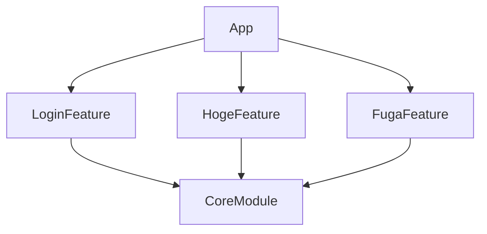
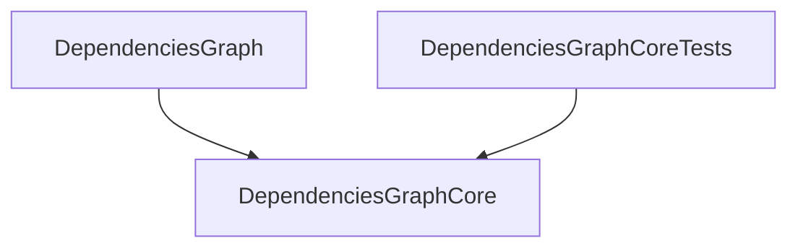

# swift-dependencies-graph
CLI tool to output mermaid diagrams of module dependencies for multi-modularized projects in Swift Package Manager.

## Installation
#### Mint
```
Ryu0118/swift-dependencies-graph@0.1.0
```

#### Homebrew
```
$ brew install Ryu0118/dgraph/dgraph
```
##### update
```
$ brew update
$ brew upgrade Ryu0118/dgraph/dgraph
```

## Usage
```
USAGE: dgraph <project-path> [--add-to-readme] [--include-product] [--strip-transitive]

ARGUMENTS:
  <project-path>          Project root directory

OPTIONS:
  --add-to-readme         Add Mermaid diagram to README
  --include-product       Include .product(name:package:)
  --strip-transitive      Strip transitive dependencies to avoid redundant arrows
  -h, --help              Show help information.
```

## Converting Mermaid Diagrams to Images

To convert the generated Mermaid diagrams to image files (SVG, PNG, PDF), you need to install and use [mermaid-cli](https://github.com/mermaid-js/mermaid-cli).

### Prerequisites

1. **Install Node.js** (if not already installed)
   ```bash
   # Using Homebrew on macOS
   brew install node

   # Or download from https://nodejs.org/
   ```

2. **Install Mermaid CLI globally**
   ```bash
   npm install -g @mermaid-js/mermaid-cli
   ```

### Step-by-Step Process

1. **Generate Mermaid diagram** using this tool:
   ```bash
   dgraph /path/to/your/swift/project > dependencies.mmd
   ```

2. **Convert to image format**:
   ```bash
   # Convert to SVG
   mmdc -i dependencies.mmd -o dependencies.svg

   # Convert to PNG
   mmdc -i dependencies.mmd -o dependencies.png

   # Convert to PNG with dark theme
   mmdc -i dependencies.mmd -o dependencies.png -t dark

   # Convert to PNG with transparent background
   mmdc -i dependencies.mmd -o dependencies.png -b transparent
   ```

## Example


## Package Dependencies

