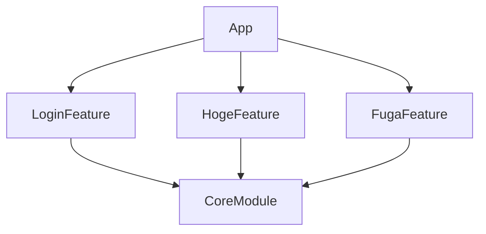
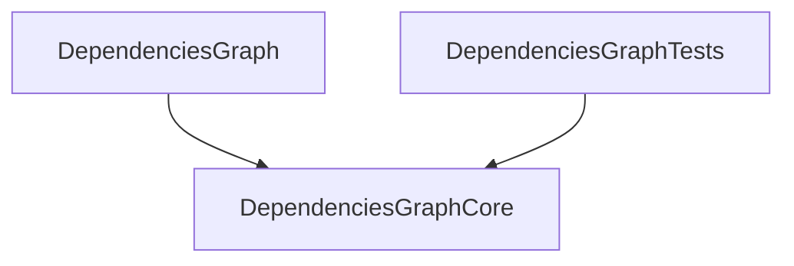

# swift-dependencies-graph
CLI tool to output mermaid dependencies between Swift Package Manager targets

## Usage
```
USAGE: dgraph <project-path> [--add-to-readme]

ARGUMENTS:
  <project-path>          Project root directory

OPTIONS:
  --add-to-readme         Add Mermaid diagram to README
  -h, --help              Show help information.
```

## Example


## Package Dependencies

